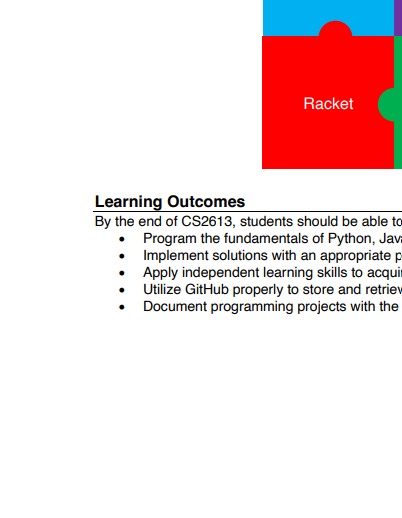

# PyPDF  
PyPDF is a free and open-source PDF toolkit, proficient in multitudes of manipulations such as splitting, merging, cropping and transforming pages within PDF files. Additionally, it can add custon date, viewing preferences, and password protection to these files. PyPDF can retrive text and metadata from PDFs as well.  

## Installation
One can install pypdf using the follwing pip install:
```
pip install pypdf
```  

## Purpose
With this package, there are many different operations that can be done. A few examples can be seen below

### Merging
```
from pypdf import PdfWriter

merger = PdfWriter()

input1 = open("doc1.pdf", "rb")
input2 = open("doc2.pdf", "rb")
input3 = open("doc3.pdf" , "rb")

# Adds the first 3 pages of input1 document to output
merger.append(fileobj=input1, pages=(0,3))

# Inserts the first page of input2 into the output beginning after the second page
merger.merge(position=2, fileobg=input2, pages=(0,1))

## Appends the entire input3 document to the end of the output document
merger.append(input3)

# Write to an output PDF document
output = open("document-output.pdf", "wb")
merger.write(output)

# Close file descriptors 
merger.close()
output.close()
```

### Cropping
```
from pypdf import PdfWriter, PdfReader

reader = PdfReader("example.pdf")
writer = PdfWriter()

# add page 1 from reader to output document, unchanged:
writer.add_page(reader.pages[0])

# add page 2 from reader, but rotated clockwise 90 degrees:
writer.add_page(reader.pages[1].rotate(90))

# add page 3 from reader, but crop it to half size:
page3 = reader.pages[2]
page3.mediabox.upper_right = (
    page3.mediabox.right / 2,
    page3.mediabox.top / 2,
)
writer.add_page(page3)
```

### Data encryption
```
from pypdf import PdfReader, PdfWriter

reader = PdfReader("example.pdf")
writer = PdfWriter()

# Add all pages to the writer
for page in reader.pages:
    writer.add_page(page)

# Add a password to the new PDF
writer.encrypt("my-secret-password", algorithm="AES-256")

# Save the new PDF to a file
with open("encrypted-pdf.pdf", "wb") as f:
    writer.write(f)
```

## Sample Input Output
The input pdf file is the course syllabus for CS2613
```
from pypdf import PdfWriter, PdfReader

reader = PdfReader("inputpdf.pdf")
writer = PdfWriter("output.pdf")

# Rotates page 1
writer.add_page(reader.pages[0])
writer.pages[0].rotate(90)

# Adds cropped page 1
page1 = reader.pages[0]
page1.mediabox.upper_right = (
    page1.mediabox.right / 2,
    page1.mediabox.top / 2,
)
writer.add_page(page1)


# Adds page 4
writer.add_page(reader.pages[3])

# Saves the output to output.pdf
with open("output.pdf", "wb") as fp:
    writer.write(fp)
```
### Output




## References
[1] PyPDF Github: [https://github.com/py-pdf/pypdf](https://github.com/py-pdf/pypdf)  
[2] PyPDF User's Guide [https://pypdf.readthedocs.io/en/stable/index.html](https://pypdf.readthedocs.io/en/stable/index.html)